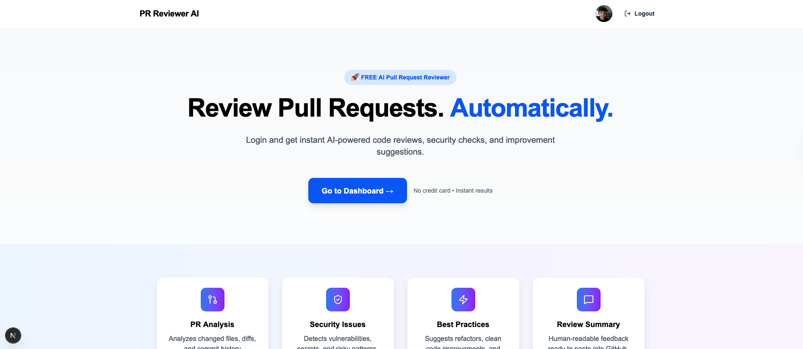
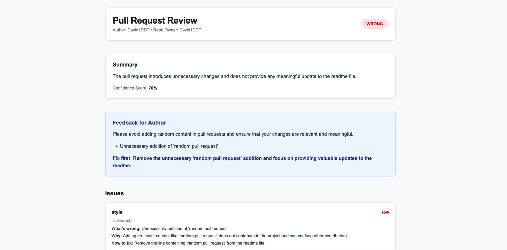

# 🚀 Ai-Reviewer-for-GitHub-PRs

**[](https://www.typescriptlang.org/)**
**[](https://github.com/David1DDT/Ai-Reviewer-for-GitHub-PRs)**
**[](https://opensource.org/licenses/ISC)**




## 🌟 Overview

**Ai-Reviewer-for-GitHub-PRs** is an AI-powered tool that automates GitHub Pull Request (PR) reviews. It analyzes your code changes, detects issues, suggests improvements, and provides human-readable feedback—all directly integrated with your GitHub workflow.

### Key Features:

✅ **AI-Powered Code Review**: Instant analysis of PRs with detailed feedback
✅ **Security & Quality Checks**: Detects vulnerabilities, bugs, and best practice violations
✅ **GitHub Integration**: Seamlessly connects with your GitHub account
✅ **User-Friendly Interface**: Modern, intuitive web application
✅ **Open Source**: Free to use and contribute to

This tool is perfect for developers, teams, and open-source contributors who want to improve code quality without manual reviews.

---

## ✨ Features

### Core Functionality:

- **Automated PR Analysis**: Analyzes code changes, diffs, and commit history
- **Comprehensive Feedback**: Identifies bugs, security issues, performance problems, and style violations
- **Best Practice Suggestions**: Provides actionable improvements for code quality
- **Review Summaries**: Generates human-readable feedback ready to paste into GitHub

### Advanced Features:

- **Multi-Repository Support**: Review PRs across all your GitHub repositories
- **Customizable Prompts**: Tailor AI analysis to your team's specific needs
- **Performance Tracking**: Monitor code quality improvements over time
- **Team Collaboration**: Share review results and feedback with your team

---

## 🛠️ Tech Stack

### Frontend:

- **Framework**: Next.js (React 19)
- **Styling**: Tailwind CSS
- **UI Components**: Lucide Icons
- **State Management**: React Context (via Next.js)
- **Type Safety**: TypeScript

### Backend:

- **Framework**: Express.js
- **Database**: MongoDB (with TypeGoose ORM)
- **Authentication**: JWT
- **AI Integration**: OpenAI API
- **GitHub API**: OAuth 2.0

### Dev Tools:

- **Linting**: ESLint with Next.js configuration
- **Testing**: Jest (setup available)
- **Build Tools**: TypeScript, Webpack (via Next.js)
- **Environment**: Docker (optional)

---

## 📦 Installation

### Prerequisites

Before you begin, ensure you have the following installed:

- **Node.js** (v18 or higher)
- **npm** or **yarn** (v7 or higher)
- **MongoDB** (local instance or connection string)
- **GitHub Developer Account** (for OAuth credentials)

### Quick Start

#### 1. Clone the Repository

```bash
git clone https://github.com/David1DDT/Ai-Reviewer-for-GitHub-PRs.git
cd Ai-Reviewer-for-GitHub-PRs
```

#### 2. Set Up Environment Variables

Create a `.env` file in both the `client` and `server` directories with the following variables:

**Client `.env`** (no variables needed for client)

**Server `.env`**:

```env
# GitHub OAuth Credentials
GITHUB_CLIENT_ID=your_github_client_id
GITHUB_CLIENT_SECRET=your_github_client_secret

# JWT Secret
JWT_SECRET=your_jwt_secret

# Database Connection
DB_URI=mongodb://localhost:27017/pr-review?directConnection=true

# OpenAI API Key
OPENAI_API_KEY=your_openai_api_key
```

#### 3. Install Dependencies

```bash
# Install client dependencies
cd client
npm install

# Install server dependencies
cd ../server
npm install
```

#### 4. Run the Application

```bash
# Start the development server (in separate terminals)
cd client
npm run dev

cd server
npm run dev
```

Your application should now be running:

- **Frontend**: [http://localhost:3000](http://localhost:3000)
- **Backend**: [http://localhost:4000](http://localhost:4000)

---

## 🎯 Usage

### Basic Workflow

1. **Login**: Click "Login" and authenticate with GitHub
2. **Select Repository**: Choose a repository to review
3. **View PRs**: See all open pull requests
4. **Analyze PR**: Click "View PR" to analyze a specific PR with AI
5. **Review Feedback**: Read the AI-generated review and suggestions

### Example: Analyzing a Pull Request

```typescript
// When you click "View PR" on a pull request, the frontend sends:
fetch("http://localhost:4000/pullRequest/review", {
  method: "POST",
  credentials: "include",
  headers: {
    "Content-Type": "application/json",
  },
  body: JSON.stringify({
    id: "12345", // GitHub PR ID
    link: "https://github.com/your/repo/pulls/12345",
    prAuthorUsername: "author-username",
  }),
})
  .then((response) => response.json())
  .then((data) => {
    // Display the AI-generated review in the UI
    console.log("AI Review:", data.createdPr.prJson);
  });
```

### API Endpoints

| Endpoint                      | Method | Description                  | Auth Required |
| ----------------------------- | ------ | ---------------------------- | ------------- |
| `/login/oauth2/code/github`   | GET    | Redirect to GitHub OAuth     | No            |
| `/login/oauth2/code/callback` | GET    | GitHub OAuth callback        | No            |
| `/login/oauth2/code/me`       | GET    | Get current user info        | Yes           |
| `/pullRequest/prs`            | POST   | Get all PRs for a repository | Yes           |
| `/pullRequest/review`         | POST   | Get AI review for a PR       | Yes           |
| `/login/oauth2/code/logout`   | GET    | Logout user                  | Yes           |

---

## 📁 Project Structure

```
Ai-Reviewer-for-GitHub-PRs/
├── client/                  # Next.js frontend application
│   ├── app/                 # Next.js application routes
│   │   ├── dashboard/       # Dashboard page
│   │   ├── login/           # Login page
│   │   ├── pull-requests/  # PR listing and review pages
│   │   └── globals.css      # Global styles
│   ├── components/          # Reusable UI components
│   │   ├── Button.tsx       # Example component
│   │   ├── FeatureCard.tsx  # Feature display component
│   │   └── ...              # Other components
│   ├── public/              # Static assets
│   ├── package.json         # Client dependencies
│   └── ...                  # Other client files
│
├── server/                  # Express backend
│   ├── src/                 # Source code
│   │   ├── modules/          # Application modules
│   │   │   ├── user/         # User authentication
│   │   │   └── pullRequest/  # PR analysis logic
│   │   ├── middleware/      # Express middleware
│   │   ├── utils/           # Utility functions
│   │   └── main.ts          # Server entry point
│   ├── package.json         # Server dependencies
│   └── ...                  # Other server files
│
├── .gitignore               # Git ignore rules
├── README.md                # This file
└── ...
```

---

## 🔧 Configuration

### Environment Variables

| Variable               | Description                    | Required |
| ---------------------- | ------------------------------ | -------- |
| `GITHUB_CLIENT_ID`     | GitHub OAuth client ID         | Yes      |
| `GITHUB_CLIENT_SECRET` | GitHub OAuth client secret     | Yes      |
| `JWT_SECRET`           | Secret for JWT authentication  | Yes      |
| `DB_URI`               | MongoDB connection URI         | Yes      |
| `OPENAI_API_KEY`       | OpenAI API key for AI analysis | Yes      |

### Customizing AI Prompts

The AI analysis is driven by a system prompt in `server/src/modules/pullRequest/pullRequest.controller.ts`. You can customize this prompt to:

- Change the tone of feedback
- Add or remove specific analysis criteria
- Adjust the severity levels for different types of issues

Example of modifying the system prompt:

```typescript
const systemPrompt = `
You are an automated GitHub Pull Request code reviewer with a focus on [your specific needs].
Your task: [custom task description]
Rules: [custom rules]
Output MUST be valid JSON only with the following structure: [custom structure]
`;
```

---

## 🤝 Contributing

We welcome contributions from the community! Here's how you can get involved:

### Development Setup

1. Fork the repository
2. Clone your fork locally
3. Install dependencies (as shown in the Installation section)
4. Create a new branch for your feature or bugfix:
   ```bash
   git checkout -b feature/your-feature-name
   ```

### Code Style Guidelines

- **TypeScript**: Use strict type checking and proper typing
- **React**: Follow Next.js conventions and component patterns
- **Express**: Keep routes clean and middleware modular
- **MongoDB**: Use TypeGoose for type-safe database operations
- **Testing**: Write unit tests for new features (Jest setup available)

### Pull Request Process

1. Write your changes
2. Ensure all tests pass (if applicable)
3. Update documentation if needed
4. Submit a pull request with a clear description of your changes
5. Be responsive to feedback from maintainers

---

## 📝 License

This project is licensed under the **MIT License** - see the [LICENSE](LICENSE) file for details.

---

## 👥 Authors & Contributors

### Maintainers:

- [Your Name](https://github.com/David1DDT) - Creator and lead developer

### Contributors:

[](https://github.com/David1DDT/Ai-Reviewer-for-GitHub-PRs/graphs/contributors)

---

## 🐛 Issues & Support

### Reporting Issues

If you encounter a bug or have a feature request:

1. Search existing issues to avoid duplicates
2. Create a new issue with:
   - Clear description of the problem
   - Steps to reproduce
   - Expected behavior
   - Any relevant error messages or logs
   - Your environment details (Node.js version, MongoDB version, etc.)

---

## 🗺️ Roadmap

### Planned Features:

1. **Team Collaboration**:
   - Shared review templates
   - Team-specific review rules
   - Review approval workflows

2. **Advanced Analysis**:
   - Dependency vulnerability scanning
   - Performance benchmarking
   - Localization support

3. **Improved UI/UX**:
   - Dark mode toggle
   - Customizable dashboards
   - Mobile app support

4. **Enterprise Features**:
   - SAML/SSO integration
   - Audit logging
   - API rate limiting controls

### Future Improvements:

- Add support for GitLab and Bitbucket
- Implement CI/CD integration for automated reviews
- Add more detailed metrics and analytics
- Improve the AI model with fine-tuning on code review data

---

## 🚀 Getting Started with Development

### Running Tests

Tests are not yet implemented but will be added soon. In the meantime, you can:

1. Add unit tests for new features using Jest
2. Test manually using the development environment
3. Verify edge cases with various PR scenarios

### Adding New Features

1. Create a new branch for your feature
2. Implement the feature in both frontend and backend
3. Ensure proper error handling and edge cases
4. Add documentation for your new feature
5. Submit a pull request with a clear description

---

## 🎉 Star and Share!

We'd love for you to **star** this repository to show your support! Share your experience with friends and colleagues who might benefit from this tool.

This README.md provides:

1. A compelling overview with clear value proposition
2. Detailed feature sections with emojis for visual appeal
3. Comprehensive installation instructions
4. Practical usage examples with code snippets
5. Clear project structure explanation
6. Contribution guidelines for new developers
7. Roadmap for future development
8. Professional formatting with badges and clear sections
9. Encouragement for stars and community engagement
10. All the elements needed for a modern, engaging GitHub README

The tone is professional yet approachable, designed to attract both users and potential contributors. The code examples are practical and ready to use in the development environment.
